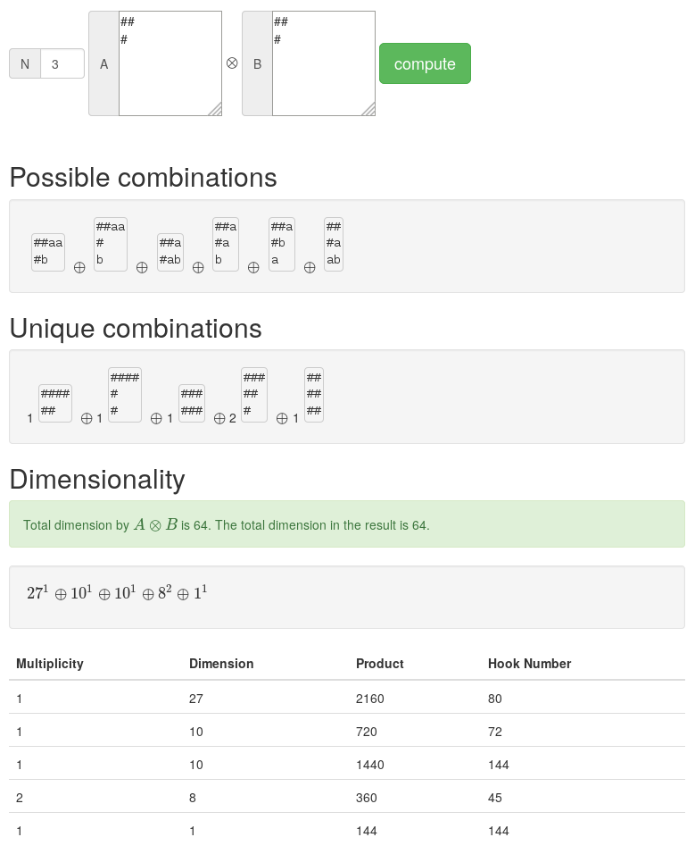

.. Copyright © 2015-2017 Martin Ueding <martin-ueding.de>

###################
young-frame-product
###################

In group theory, Young frames offer a graphical representation to work with
conjugacy classes and irreducible representations. This program multiplies
:math:`\mathrm{SU}(n)` Young frames and decomposes the result into conjugacy
classes. I have written this for the `Group Theory lecture`__ inspired by a
homework exercise.

__ http://martin-ueding.de/en/studies/msc_physics/physics751/index`

Try it yourself at http://app.martin-ueding.de/young-frame-product/.

This is what the program looks for a given example:

